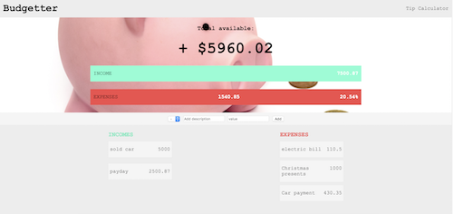
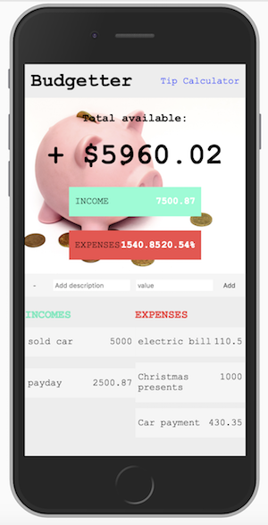

# Budgetter
- A simple web app that users can use to determine where they stand with regards to spending and income. 
- Button in top right of page takes the user to a bare-bones tip calculator. 

- This was a quick side project I built to keep my Frontend skills sharp as we progressed into backend in class. 

## Future additions 
- Add a backend with Node.js to allow users to store their data
- More fluid frontend with React.js
- Integrate it as a mobile app using React Native